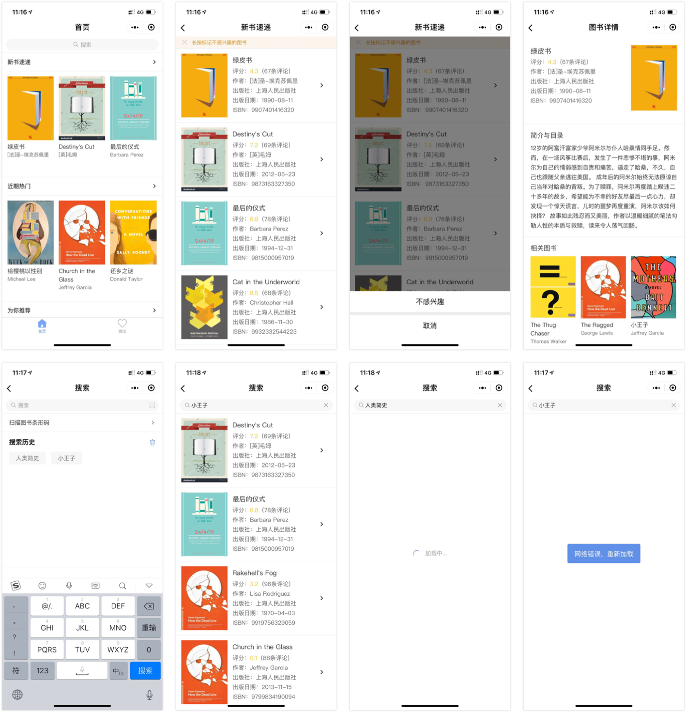
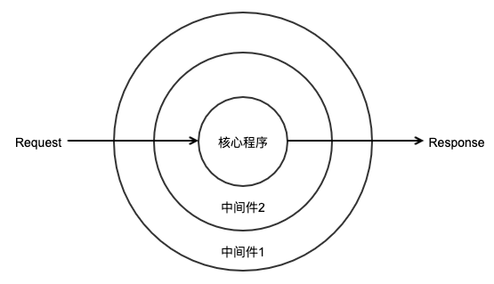

## 项目简介

本项目是[在线借书平台](https://github.com/imageslr/weapp-library)小程序使用 [Taro](https://nervjs.github.io/taro/docs/GETTING-STARTED.html) 重构后的版本，仅包含三个示例页面，非常简单。面向人群主要是 Taro/React/Redux 的初学者，目的是提供一个简单的实践项目，帮助理解 Taro 与 Redux 的配合方式与 Taro 的基本使用。本项目还提供了一个快速搭建本地 mock 服务的解决方案。

因为我也是刚接触 Taro/React，所以只是分享一些开发经验，绕开一些小坑。如果觉得不错的话，请点右上角“⭐️Star”支持一下我，谢谢！如果有问题，欢迎提 issue；如果有任何改进，也欢迎 PR。

## 技术栈

Taro + Taro UI + Redux + Webpack + ES6 + Mock

## 项目截图



## 目录

- [项目简介](#项目简介)
- [技术栈](#技术栈)
- [项目截图](#项目截图)
- [运行项目](#运行项目)
- [开始学习](#开始学习)
  - [Taro 简介](#taro-简介)
  - [开发工具](#开发工具)
  - [样式规范](#样式规范)
- [项目初始化](#项目初始化)
- [引入 Redux](#引入-redux)
  - [Redux 文件设置](#redux-文件设置)
  - [connect 方法](#connect-方法)
  - [使用 connect 方法](#使用-connect-方法)
  - [异步 Action](#异步-action)
- [API 封装](#api-封装)
  - [域名切换](#域名切换)
  - [封装请求](#封装请求)
  - [添加拦截器](#添加拦截器)
  - [async 和 await](#async-和-await)
- [搭建本地 mock 服务](#搭建本地-mock-服务)
  - [安装依赖](#安装依赖)
  - [设置 json-server](#设置-json-server)
  - [启动服务](#启动服务)
  - [补充说明](#补充说明)
- [其他补充](#其他补充)
  - [Taro JSX](#taro-jsx)
  - [Taro 生命周期](#taro-生命周期)
  - [运行配置相关](#运行配置相关)
    - [允许在 sass 中通过别名引入其他 sass 文件](#允许在-sass-中通过别名引入其他-sass-文件)
    - [引入 iconfont 图标](#引入-iconfont-图标)


## 运行项目

本项目在以下环境中编译通过：taro v1.2.20、nodejs v8.11.2、gulp v3.9.1、微信开发者工具最新版

```
$ git clone https://github.com/imageslr/taro-library.git

$ cd taro-library

$ npm install 或者 yarn

$ npm run dev:weapp

// 新建一个终端，在项目根目录下执行
$ gulp mock
```

## 开始学习

### Taro 简介

[Taro](https://nervjs.github.io/taro/docs/GETTING-STARTED.html) 是一个遵循 [React](https://reactjs.org/) 语法规范的多端开发解决方案。最近想学习 React，于是就想到使用 Taro 重构很早之前开发的[在线借书平台](https://github.com/imageslr/weapp-library)小程序。虽然 Taro 上手有一定难度，但是其 React 框架比小程序原生更为灵活与规范，给我带来了非凡的开发体验。

在正式开始之前，您必须对 Taro 框架、 React 语法与小程序框架有一定的了解。此外，我建议您阅读以下文档，会更容易上手：

- [Taro 官方文档](https://nervjs.github.io/taro/docs/README.html)：必读，开发时也会随时查阅
- [Taro UI 官方文档](https://taro-ui.aotu.io/#/docs/introduction)：推荐，本项目使用 Taro UI 作为 UI 组件库
- [React 官方文档](https://reactjs.org/docs/hello-world.html)：必读，掌握 React 语法的必经之路，读完 MAIN CONCEPTS 部分就差不多了。对应的中文文档[在这里](https://react.docschina.org/docs/hello-world.html)，与英文版略有区别
- [Redux 文档](https://www.redux.org.cn/)：推荐，Redux 是最经常与 React 搭配使用的状态管理库。不过这个文档过于详实，读起来比较费劲，推荐你掌握 Redux 三大概念（Action、Reducer、Store）后直接在实践中体会 Redux 的原理与作用
- [React.js 小书](http://huziketang.mangojuice.top/books/react/)：推荐，一步步从零构建 React 与 Redux，非常好的入门教程
- [Mock.js 文档](http://mockjs.com/examples.html)：推荐，速查模拟数据占位符与模板

### 开发工具

开发工具：VS Code  
代码规范：[Prettier](https://prettier.io/) 插件 + ES Lint 插件

VS Code 对 JSX 与 TypeScript 有天然的支持，使用 VS Code 开发 Taro，不需要配置任何插件就能实现 Taro 组件的自动 import 与 props 提示，非常方便。

代码格式化插件我选择 [Prettier](https://prettier.io/)，它屏蔽了很多配置项，强制遵循约定的规范。与之类似的格式化插件还有 Beautify，不过我更喜欢 Prettier 对 JSX 属性强制自动换行的风格。

ES Lint 是 JavaScript 与 JSX 的静态检测工具，安装 ES Lint 插件后在代码编写阶段就可以检测到不易发现的错误（如为常量赋值、变量未使用、变量未定义等等）。Taro 已经定义了一套 ES Lint 规则集，使用 taro-cli 生成的 Taro 项目基本不需要再作额外配置。

### 样式规范

#### CSS 预处理器

[Taro UI](https://taro-ui.aotu.io/#/docs/introduction) 定义了很多[变量](https://github.com/NervJS/taro-ui/blob/dev/src/style/variables/default.scss)与[可复用的 mixins](https://github.com/NervJS/taro-ui/tree/dev/src/style/mixins/libs)。为了与 Taro UI 样式风格保持一致，本项目采用 Taro UI 所使用的 Sass 作为 CSS 预处理器。

#### 布局

优先使用 Flex 布局。学习 Flex 布局可以参考这两篇文章：

- [阮一峰 - Flex 布局教程：语法篇](http://www.ruanyifeng.com/blog/2015/07/flex-grammar.html)
- [阮一峰 - Flex 布局教程：实例篇](http://www.ruanyifeng.com/blog/2015/07/flex-examples.html)

Taro UI 封装了一些常用的 [Flex 样式类](https://taro-ui.aotu.io/#/docs/flex)，包括：

- 1~12 的栅格化长度类`at-col-1`、`at-col-2`等
- 栅格化偏移类`at-col__offset-1`等
- `flex`属性：超出换行`at-row--wrap`，宽度根据内容撑开`at-col--auto`
- 对齐方式、排列方式

不过 Taro UI 并没有为`flex: none;`提供样式类。

#### BEM 命名规范

关于 BEM，网上有很多的教程，就不再细说了。`Block__Element--Modifier`的命名方式在 Sass 中很容易描述：

```less
.block {
  //...
  &__element {
    //...
    &--modifier {
      //...
    }
  }
}
```

不过有时候依然会遇到命名问题：在 HTML 中是父子关系的元素，其类名是否也应该是包含关系呢？比如下面这个例子：

```html
<form class="search-bar">
  <div class="search-bar__content">
    <input class="search-bar__content__input" />
    <button class="search-bar__content__button">搜索</button>
  </div>
</form>
```

`search-bar__content`中包含两个子元素`input`和`button`，于是我想当然地就将`input`和`button`的类名命名为`search-bar__content__input`和`search-bar__content__button`。但是这种命名方式违背了 BEM 命名规范，变成了`B-E-E-M`。

在这里，我参考[使用 BEM 的几个注意事项](http://lightcss.com/common-mistakes-of-bem-naming/)中列举的几个原则对上例进行了修改：

- 如果一个区域可以复用且不依赖其它组件，则可作为一个块（Block）
- 如果一个区域不能拿到外部单独使用，那么就应该作为一个元素（Element）
- 元素不能包含元素

所以上面的示例有以下两种修改方式：

_1. `search-bar-content`作为单独的块，`input`、`button`是`search-bar-content`这个块的子元素_

```html
<form class="search-bar">
  <div class="search-bar-content">
    <input class="search-bar-content__input" />
    <button class="search-bar-content__button">搜索</button>
  </div>
</form>
```

_2. `search-bar__content`不作为单独的块，则`search-bar__content`、`search-bar__input`与`search-bar__button`平级，均是`search-bar`这个块的子元素_

```html
<form class="search-bar">
  <div class="search-bar__content">
    <input class="search-bar__content-input" />
    <!-- search-bar__input 亦可 -->
    <button class="search-bar__content-button">搜索</button>
    <!-- search-bar__button 亦可 -->
  </div>
</form>
```

#### 组件样式

对于`/components`目录下的可复用组件，使用`my`作为命名空间，避免被全局样式污染，比如`my-panel`、`my-search-bar`等。

组件可以使用`externalClasses`定义若干个外部样式类，或者开启`options.addGlobalClass`以使用全局样式。见[Taro 文档 - 组件的外部样式和全局样式](https://nervjs.github.io/taro/docs/component-style.html)。

如果希望能够在组件的`props`中直接传递`className`或者`style`，比如这样：

```JSX
// index.jsx
<MyComponent className='custom-class' style={/* ... */}>
```

Taro 默认并不支持这一写法。我们可以将`className`和`customStyle`作为组件的`props`，然后在`render()`中手动将这两个`props`添加到根元素上：

```JSX
// my-component.jsx
export default MyComponent extends Component {
  static options = {
    addGlobalClass: true
  }

  static defaultProps = {
    className: '',
    customStyle: {}
  }

  render () {
    const { className, customStyle } = this.props
    return <View
      className={'my-class ' + className}
      style={customStyle}
    >
      组件内容
    </View>
  }
}
```

#### 尺寸单位

[Taro 文档 - 设计稿及尺寸单位](https://nervjs.github.io/taro/docs/size.html)

Taro 的尺寸单位是`px`，默认的尺寸稿是 iPhone 6 750px。Taro 会 1:1 地将`px`转为小程序的`rpx`。而在小程序中，`px`与`rpx`是 1:2 的关系。如果希望字体采用浏览器的默认大小`14px`，那么应该这么写：

- Taro：`28px`
- Taro：`14PX`
- Taro JSX 行内样式：`Taro.pxTransform(14)`
- 小程序原生：`28rpx`

Taro 会将有大写字母的`Px`或`PX`忽略，但是 VS Code 在使用 Prettier 插件时会自动将`Px`或`PX`转为`px`。对于这个问题，有两种解决方案：

- 换用 Beautify 插件
- 在包含大写字母的属性的前一行添加`/* prettier-ignore */`
  ```scss
  /* prettier-ignore */
  $input-padding: 25PX;
  ```

## 项目初始化

```
$ taro init taro-library
> ...
> ? 请输入项目介绍！ Taro图书小程序
> ? 是否需要使用 TypeScript ？ No
> ? 请选择 CSS 预处理器（Sass/Less/Stylus） Sass
> ? 请选择模板 Redux 模板
>
> ✔ 创建项目: taro-library
```

安装项目依赖：

```
$ npm install taro-ui && npm install json-server mockjs gulp gulp-nodemon browser-sync --save-dev
```

## 引入 Redux

### Redux 文件设置

在初始化的时候，我们选择了 Redux 模板。打开文件夹，可以看到 Taro 创建了一个示例页面，redux 相关的文件夹为：

```
├── actions
│   └── counter.js
├── constants
│   └── counter.js
├── reducers
│   ├── counter.js
│   └── index.js
└── store
    └── index.js
```

这种方式是按照 Redux 的组成部分来划分的，`/constants`是`action-type`字符串的声明文件，不同文件夹中的同名文件对应同一份数据。

另一种划分方式是将同一份数据的所有文件组合在同一个文件夹里：

```
└── store
    ├── counter
    │   ├── action-type.js // 对应/constants/counter.js
    │   ├── action.js // 对应/actions/counter.js
    │   └── reducer.js // 对应/reducers/counter.js
    ├── home
    │   ├── action-type.js
    │   ├── action.js
    │   └── reducer.js
    ├── index.js // 对应/store/index.js
    └── rootReducer.js // 对应/reducer/index.js
```

本项目采用第二种方式管理 Redux 数据。Taro 生成的 Redux 模板中已经添加了`redux-logger`中间件实现日志打印功能。

代码见 [dev-redux-init 分支](https://github.com/imageslr/taro-library/tree/dev-redux-init)。

### connect 方法

推荐先阅读 [Redux 文档](https://www.redux.org.cn/)。

使用 Redux 之后，我们可以将数据存储在`store`中，通过`action`操作数据。那么怎么在组件中访问与操作数据呢？`react-redux`提供了`connect`方法，允许我们将`store`中的数据与`action`作为`props`绑定到组件上。

从原理上来讲，`connect`方法返回的是一个高阶组件。这个高阶组件会对原组件进行包装，然后返回新的组件。不过我们这里不讲`connect`的细节，只讲它的使用方法。有关`connect`方法与 Redux 的原理，推荐阅读 [React.js 小书](http://huziketang.mangojuice.top/books/react/)。

#### 参数

`connect`接收四个参数，分别是`mapStateToProps`、`mapDispatchToProps`、`mergeProps`和`options`。本项目只用到了前两个参数。

#### mapStateToProps

`mapStateToProps`是一个函数，它将`store`中的数据映射到组件的`props`上。`mapStateToProps`接收两个参数：`state`、`ownProps`。第一个参数就是 Redux 的`store`，第二个数据是组件自己的`props`。

举个例子：

```JS
const mapStateToProps = (state) => {
  return {
    count: state.count
  }
}
```

这段代码的功能是将`store`中的`count`属性的值，映射到组件的 `this.props.count` 上。当我们访问`this.props.count`时，输出的就是`store.count`的值。当`store.count`值变化时，组件也会同步更新。

我们还可以使用 ES6 的对象[解构赋值](https://developer.mozilla.org/zh-CN/docs/Web/JavaScript/Reference/Operators/Destructuring_assignment)、属性简写和箭头函数等语法，进一步简化上面的代码：

```js
const mapStateToProps = ({ count }) => ({
  count
});
```

有时候我们需要根据组件自身的`props`作一些条件判断，这时候就需要用到第二个参数。

#### mapDispatchToProps

`mapDispatchToProps`也是一个函数，它接收两个参数：`dispatch`、`ownProps`。第一个参数就是 Redux 的`dispatch`方法，第二个数据是组件自己的`props`。它的功能是将`action`作为`props`绑定到组件上。

举个例子：

```JS
import { add, minus, asyncAdd } from "@store/counter/action";

const mapDispatchToProps = (dispatch) => {
  return {
    add() {
      dispatch(add());
    },
    dec() {
      dispatch(minus());
    },
    asyncAdd() {
      dispatch(asyncAdd());
    }
  }
}
```

当我们**调用**`this.props.add`时，实际上是在调用`dispatch(add())`。

### 使用 connect 方法

使用`connect`方法将组件与 Redux 结合：

```jsx
import { add, minus, asyncAdd } from "@store/counter/action";

// 首先定义组件
class MyComponent extends Component {
  render() {
    return;
    <View>
      <Button onClick={this.props.add}>点击 + 1</Button>
      <View>计数：{this.props.count}次</View>
    </View>;
  }
}

// 定义 mapStateToProps
const mapStateToProps = ({ count }) => ({
  count
});

// 定义 mapDispatchToProps
const mapDispatchToProps = dispatch => {
  return {
    add() {
      dispatch(add());
    }
  };
};

// 使用 connect 方法，export 包装后的新组件
export connect(mapStateToProps， mapDispatchToProps)(MyComponent);
```

这种分散的写法不利于我们查看组件从 Redux 中引入了多少`props`。我们可以使用 ES6 的[装饰器语法](https://aotu.io/notes/2016/10/24/decorator/index.html)进一步改造它：

```JSX
import { add, minus, asyncAdd } from "@store/counter/action";

@connect(
  ({ counter }) => ({
    counter
  }),
  dispatch => ({
    add() {
      dispatch(add());
    }
  })
)
class MyComponent extends Component {
  render() {
    return;
    <View>
      <Button onClick={this.props.add}>点击 + 1</Button>
      <View>计数：{this.props.count}次</View>
    </View>;
  }
}

export default MyComponent;
```

我们甚至可以使用对象形式来传递`mapDispatchToProps`，获得更简化的写法：

```js
@connect(
  ({ counter }) => ({
    counter
  }),
  {
    // 调用 this.props.dispatchAdd() 相当于
    // 调用 dispatch(add())
    dispatchAdd: add,
    dispatchMinus: minus,
    // ...
  }
)
```

这就是 Taro 组件与 Redux 结合的最终形式。

### 异步 Action

异步 Action 返回的是一个参数为`dispatch`的函数，这个函数本身也可以被`dispatch`。我们只需要在 Redux 中引入`redux-thunk`中间件，就可以使用异步 Action。关于异步 Action 的原理，可以查看[Redux 官方文档](https://www.redux.org.cn/docs/advanced/AsyncActions.html)。

Taro Redux 模板提供了一个异步 Action 的简单示例：

```JS
/* /store/counter/action.js */
export function asyncAdd() {
  return dispatch => {
    setTimeout(() => {
      dispatch(add());
    }, 2000);
  };
}

// 组件中
@connect(
  ({ counter }) => ({
    counter
  }),
  dispatch => ({
    asyncAdd() {
      dispatch(asyncAdd());
    }
  })
)
class MyComponent extends Component {
  render () {
    return <Button onClick={this.props.asyncAdd}>点击 + 1</Button>
  }
}
```

可以看到，异步 Action 和常规 Action 在使用上并没有任何区别。

## API 封装

Taro 已经封装了[网络请求](https://nervjs.github.io/taro/docs/native-api.html)，支持 Promise 化使用。本项目对`Taro.request()`进一步封装，以便统一管理接口、根据不同环境选择不同域名、设置请求拦截器、响应拦截器等。完整代码见 [/src/service](https://github.com/imageslr/taro-library/tree/master/src/service) 文件夹。

### 域名切换

生产环境使用线上接口，开发环境使用本地接口。新建`/service/config.js`文件：

```JS
export default BASE_URL =
  process.env.NODE_ENV === "development"
    ? "http://localhost:3000" // 开发环境，需要开启mock server（执行：gulp mock）
    : "TODO"; // 生产环境，线上服务器
```

### 封装请求

代码见 [/src/service/api.js](https://github.com/imageslr/taro-library/tree/master/src/service/api.js)，代码非常简单。访问后台所需要的认证信息（token）可以添加在`option.header`中。

### 添加拦截器

Taro 支持添加[拦截器](https://nervjs.github.io/taro/docs/native-api.html#%E6%8B%A6%E6%88%AA%E5%99%A8)，可以使用拦截器在请求发出前后做一些额外操作。

为什么要用拦截器呢？设想一下网络请求的场景。我们的目的是发出一个网络请求并接收响应，但是在发出请求之前，我们可能需要检查数据、添加用户的权限信息；如果项目大一些，我们可能还需要在发出请求之前先上报统计数据。这一系列流程之后才能真正执行我们的目标操作：网络请求。而获取到服务器响应后，我们还需要根据状态码执行不同的操作：401/403 跳转到登录页面，404 跳转到空白页面，500 展示错误信息...

可以看到，如果将这些流程的代码都写到一起，那么代码将又长又乱，十分复杂。

我们可以使用拦截器来解决这个问题。拦截器就是中间件，可以帮助我们优雅地分离业务逻辑。我们将每一个业务逻辑写成一个拦截器，在每个拦截器中，只需要关注当前阶段的代码实现。

中间件的处理流程又称为洋葱模型，其执行过程是：先从最外层中间件从外到内依次执行到核心程序，再从核心程序从内到外依次执行到最外层中间件，每一个中间件的执行参数均是前一个中间件的返回值。如下图所示：



下面是一个简单的中间件/拦截器示例代码：

```JS
/**
 * @param {object} req request对象
 * @param {function} next 调用下一个中间件的函数
 */
function interceptor(req, next) {
  // 在下一个中间件执行之前做一些操作...
  // 比如添加一个参数
  req.token = 'token'

  // 执行下一个中间件...
  // 保存其返回值
  var res = next(req)

  // 在下一个中间件返回结果之后做一些操作...
  // 比如判断服务器返回的状态码
  if(res.status == 401){
    // ...
  }
  return res
}

```

而`Taro.request`的拦截器函数与上例略有不同，将拦截器的调用方法改为了异步的形式：

```js
/**
 * @param {object} chain.requestParmas request对象
 * @param {function} chain.proceed  调用下一个中间件的函数
 */
function interceptor(chain) {
  // 在下一个中间件执行之前做一些操作...
  // 比如添加一个参数
  var requestParmas = chain.requestParmas;
  requestParmas.token = "token";

  // 执行下一个中间件...
  return chain.proceed(requestParmas).then(res => {
    // 在下一层行动返回结果之后做一些操作...
    // 比如判断服务器返回的状态码
    if (res.status == 401) {
      // ...
    }
    return res;
  });
}
```

采用拦截器有利于代码解耦，符合高内聚低耦合的原则。本项目将拦截器定义在一个单独的文件中，以数组形式统一导出。使用 Taro 内置拦截器`Taro.interceptors.logInterceptor`打印请求的相关信息。代码见 [/src/service/interceptors.js](https://github.com/imageslr/taro-library/tree/master/src/service/interceptors.js)。

### async 和 await

最后，当我们发起网络请求时，可以使用 ES6 的`async/await`语法代替 Promise 对象，能大大提高代码的可读性。关于 async 和 await 的原理，可以查看[理解 JavaScript 的 async/await](https://segmentfault.com/a/1190000007535316)。

一个简单示例：

```JS
// API.get() 返回一个 Promise 对象
// Promise 方法调用
function getBook(id) {
  API.get(`/books/${id}`).then(res => {
    this.setState({book: res});
  }).catch(e => {
    console.error(e);
  })
}

// async/await 语法调用
async function getBook(id) {
  try {
    const book = API.get(`/books/${id}`);
    this.setState({book: res});
  } catch(e) {
    console.error(e)
  }
}
```

## 搭建本地 mock 服务

常见的 mock 平台有 EasyMock、rap2 等，不过这些网站有时候响应较慢，调试起来也不太方便，因此在本地搭建一个 mock 服务器是更好的选择。

搭建本地 mock 服务器有几种思路，如本地安装 EasyMock，或者 php 简单写几行返回数据的代码，但是这些都需要安装额外的运行环境，工作量较大。所以我选择 [json-server](https://github.com/typicode/json-server) 实现 mock 服务，搭建过程主要参考了[纯手工打造前端后端分离项目中的 mock-server](https://yanm1ng.github.io/2017/06/12/%E7%BA%AF%E6%89%8B%E5%B7%A5%E6%89%93%E9%80%A0%E5%89%8D%E7%AB%AF%E5%90%8E%E7%AB%AF%E5%88%86%E7%A6%BB%E9%A1%B9%E7%9B%AE%E4%B8%AD%E7%9A%84mock-server/)。

[json-server](https://github.com/typicode/json-server) 是一个开箱即用的 REST API 模拟工具，它的文档中有一些简单示例。不过`json-server`还无法满足我对 mock 服务器的区别需求，所以后面还需要对它进行一些配置。

完整代码见 [/mock](https://github.com/imageslr/taro-library/tree/master/mock)。

### 安装依赖

这里需要安装几个依赖包，之前安装过就不用再装了：

```
$ npm install json-server mockjs gulp gulp-nodemon browser-sync --save-dev
```

要注意 gulp 需要是 3.9.\* 版本。后续编译小程序或者启动 mock 服务器时如果报错，再运行一遍`npm install`就好了。

### 设置 json-server

```
└── mock
    ├── factory
    │   └── book.js
    ├── db.js
    ├── routes.js
    └── server.js
```

首先使用 Mock.js 生成一些模拟数据。这部分代码见 [/mock/factory/book.js](https://github.com/imageslr/taro-library/tree/master/mock/factory/book.js)，Mock.js 的使用方式请查看[文档](http://mockjs.com/examples.html)。

然后创建 mock 数据源，代码见 [/mock/db.js](https://github.com/imageslr/taro-library/tree/master/mock/db.js)。`json-server`会将数据源中的**键名**作为接口路径名，**值**作为接口返回的数据。

`json-server`不支持在数据源的键名中添加`/`，无法直接设置`/books/new`这样的二级路径，因此我们需要使用`json-server`提供的路由重写功能：在数据源中，使用`books-new`表示`books/new`；在路由表中，将`/books/new`指向`/books-new`。代码见 [/mock/routes.js](https://github.com/imageslr/taro-library/tree/master/mock/routes.js)。

最后在 [/mock/server.js](https://github.com/imageslr/taro-library/tree/master/mock/server.js) 中添加两个中间件。一个是将所有的`POST`请求转为`GET`请求，防止数据被修改；二是为服务器设置一个 750ms 的延迟，方便查看前端的加载状态：

```JS
// 将 POST 请求转为 GET
server.use((request, res, next) => {
  request.method = "GET";
  next();
});

// 添加一个750ms的延迟
server.use((request, res, next) => {
  setTimeout(next, 750);
});
```

### 启动服务

在项目根目录下执行`gulp mock`即可启动 mock 服务器，之后改动`/mock`文件夹的任何内容，均会实时刷新 mock 服务器。代码见 [/gulpfile.js](https://github.com/imageslr/taro-library/tree/master/gulpfile.js)。

开发时，首先执行如下命令，编译小程序：

```
$ npm run dev:weapp
```

然后新建一个终端，执行以下命令，启动 mock 服务器：

```
$ gulp mock
```

之后就享受愉快的开发过程吧！

### 补充说明

1. 关闭`gulp mock`终端进程，模拟网络中断场景；修改 [/mock/server.js](https://github.com/imageslr/taro-library/tree/master/mock/server.js) 中的延迟时长，模拟 timeout 场景。
2. mock 服务器只能在电脑访问，如果想在真机上测试，可以使用 EasyMock：
   1. 启动 mock 服务器，访问`localhost:3000`，可以看到所有 mock 接口
   2. 在 EasyMock 项目中新建接口，将 mock 接口的模拟数据复制过去
   3. 将 [/src/service/config.js](https://github.com/imageslr/taro-library/tree/master/src/service/config.js) 中的开发环境`BASE_URL`改为 EasyMock 项目的`BASE_URL`
3. 参考资料：[json-server 文档](https://github.com/typicode/json-server)、[纯手工打造前端后端分离项目中的 mock-server](https://yanm1ng.github.io/2017/06/12/%E7%BA%AF%E6%89%8B%E5%B7%A5%E6%89%93%E9%80%A0%E5%89%8D%E7%AB%AF%E5%90%8E%E7%AB%AF%E5%88%86%E7%A6%BB%E9%A1%B9%E7%9B%AE%E4%B8%AD%E7%9A%84mock-server/)

## 其他补充

### Taro JSX

不能在`render()`以外的函数中返回 JSX，也就是说下面这种写法是不允许的：

```jsx
renderA() {
  return <View>A</View>
}

renderB() {
  return <View>B</View>
}

render () {
  return (
    <View>
      {someCondition1 && this.renderA()}
      {someCondition2 && this.renderB()}
    </View>
  )
}
```

### Taro 生命周期

Taro 编译到小程序端后，每个组件的`constructor`首先会被调用一次（即使没有实例化），见[Taro 文档](https://nervjs.github.io/taro/docs/best-practice.html#%E7%BB%84%E4%BB%B6%E7%9A%84-constructor-%E4%B8%8E-render-%E6%8F%90%E5%89%8D%E8%B0%83%E7%94%A8)。

在`constructor`中初始化`state`，在`componentDidMount`中发起网络请求，`componentWillMount`不知道有什么用。更多有关生命周期的知识，请查看[ Taro 文档](https://nervjs.github.io/taro/docs/component.html#componentwillmount)与[ React 组件生命周期](https://github.com/superman66/front-end-blog/issues/2)。

### 运行配置相关

#### 允许在 sass 中通过别名引入其他 sass 文件

在 sass 中通过别名（@ 或 ~）引用其他 sass 文件，有[两个解决方法](https://github.com/NervJS/taro/issues/2478)：

1. 在 js 中用`import '~taro-ui/dist/style/index.scss'`引入
2. 增加 sass 的 importer 配置，可参考 https://github.com/js-newbee/taro-yanxuan/blob/master/config/index.js

本项目采用的是第二种方法。

#### 引入 iconfont 图标

参考[ Taro UI 文档](https://taro-ui.aotu.io/#/docs/icon)

- 步骤一：修改[ /config/dev.js ](https://github.com/imageslr/taro-library/tree/master/config/dev.js)与[ /config/prod.js ](https://github.com/imageslr/taro-library/tree/master/config/prod.js)
- 步骤二：下载 iconfont 图标，保存在[ /src/assets/fonts](https://github.com/imageslr/taro-library/tree/master/src/assets/fonts)；编写字体图标库 css，代码见[ /src/styles/common/icon.scss ](https://github.com/imageslr/taro-library/tree/master/src/styles/common/icon.scss)
- 步骤三：在`app.js`中全局引入`icon.scss`
